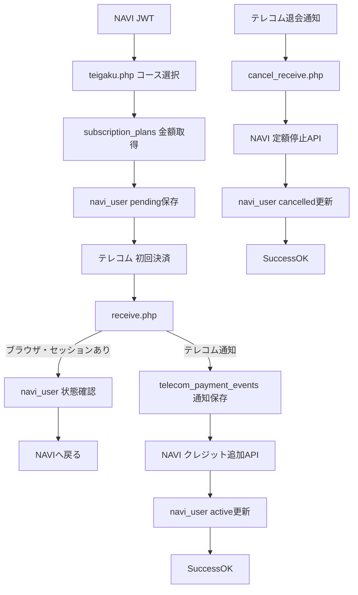

# 定額決済とDBの流れ

```mermaid
flowchart TD
    A["NAVI JWT"] --> B["teigaku.php コース選択"]
    B --> C["subscription_plans 金額取得"]
    C --> D["navi_user pending保存"]
    D --> E["テレコム 初回決済"]
    E --> F["receive.php"]
    F -->|ブラウザ・セッションあり| G["navi_user 状態確認"]
    G --> H["NAVIへ戻る"]
    F -->|テレコム通知| I["telecom_payment_events 通知保存"]
    I --> J["NAVI クレジット追加API"]
    J --> K["navi_user active更新"]
    K --> L["SuccessOK"]
    M["テレコム退会通知"] --> N["cancel_receive.php"]
    N --> O["NAVI 定額停止API"]
    O --> P["navi_user cancelled更新"]
    P --> Q["SuccessOK"]
```

## テーブル

- `subscription_plans`: 月額金額、付与クレジット数、表示名
- `navi_user`: ユーザーごとの現在の契約状態
- `telecom_payment_events`: 決済・退会通知、NAVI API処理結果、二重処理防止

NAVIをクレジット残高の正本とし、学校側DBではクレジット残高を加算しません。
